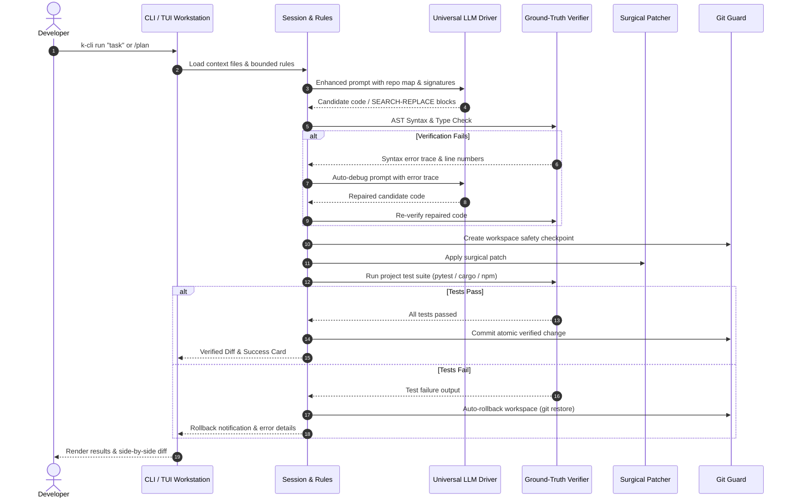

# K-CLI Architecture & Internal Design

K-CLI is a verification-first, multi-model agentic coding workstation designed for local and cloud workflows on standard developer machines.

---

## 1. High-Level Modular Architecture

K-CLI is structured into four distinct layers with clean boundaries:

```
+-----------------------------------------------------------------------------------+
|                        4. User Interface & Session Layer                          |
|   cli.py (Typer CLI)  <--->  tui_app.py (Textual Workstation)  <--->  session.py |
|   tui.py (Interactive REPL + Live Stream Renderer)                                |
+-----------------------------------------+-----------------------------------------+
                                          |
+-----------------------------------------+-----------------------------------------+
|                              1. Core Engine Layer                                 |
|   orchestrator.py (Pipeline/Memory)  <--->  llm_driver.py (Multi-Provider LLM)     |
|   verifier.py (AST / Compilers / Test Runners)                                    |
|   subagents.py (DAG Decomposition, Swarm Dispatcher, Role Workers)                 |
+--------------------+------------------------------------+-------------------------+
                     |                                    |
+--------------------+-------------------+    +-----------+-------------------------+
|     2. Knowledge & Context Layer       |    |       3. Modification & Safety Net  |
|  doc_retriever.py (SQLite FTS5 / BM25) |    |  patcher.py (SEARCH/REPLACE Blocks) |
|  repo_map.py (AST Symbol Graph)        |    |  git_guard.py (Snapshots & Rollback)|
|  rules.py (Bounded Untrusted Context)  |    |  diff_viewer.py (Side-by-Side Diffs)|
|  workflow.py (Protected Read-Only Plan)|    +-------------------------------------+
+----------------------------------------+
```

---

## 2. Core Layers & Responsibilities

### Layer 1: User Interface & Session (`cli.py`, `tui_app.py`, `tui.py`, `session.py`)
- **Textual Cyber-Workstation (`tui_app.py`)**: Full-screen terminal workstation built with Textual 8.2.8. Provides reactive status badges (RAM RSS, active model, persona, git branch, token budget), collapsible `<think>` reasoning accordions, side-by-side & unified diff viewer, live subagent swarm task trees, and quick-action chips.
- **Typer CLI (`cli.py`)**: Unix-friendly single-shot command line interface supporting `run`, `plan`, `verify`, `audit`, `diff`, `doctor`, `map`, `doc`, `feature`, and `ui` / `tui`. Supports `--json` machine-readable output for CI/CD.
- **Session Manager (`session.py`)**: Token-budgeted rolling conversational memory, context file tracking, undo/diff integration, and multi-turn execution.

### Layer 2: Core Engine & Verification (`orchestrator.py`, `llm_driver.py`, `verifier.py`, `subagents.py`)
- **Universal LLM Driver (`llm_driver.py`)**: Multi-provider client abstraction supporting Ollama, native llama.cpp / GGUF, Google Gemini, Anthropic Claude, DeepSeek, OpenRouter, OpenAI, and arbitrary OpenAI-compatible REST gateways (`--base-url`). Includes automatic provider fallback and pluggable custom adapters (`register_adapter`).
- **Ground-Truth Verifier (`verifier.py`)**: Multi-language static and dynamic verification:
  - Python AST parsing, compilation, and isolated subprocess execution with resource limits and credential filtering.
  - Bash syntax checking via `bash -n`.
  - C++ compilation checking via `g++ -fsyntax-only`.
  - Multi-framework test execution (`pytest`, `npm test`, `cargo test`, `go test`, `make test`).
- **Subagent Swarm Dispatcher (`subagents.py`)**: DAG task decomposer and parallel worker dispatcher using specialized persona roles (`EXPLORER`, `RESEARCHER`, `REFACTORER`, `TESTER`, `CODER`).

### Layer 3: Knowledge & Context (`doc_retriever.py`, `repo_map.py`, `rules.py`, `workflow.py`)
- **DevDocs SQLite Indexer (`doc_retriever.py`)**: High-speed offline SQLite FTS5 database with BM25 ranking for standard library and framework API signatures (< 5ms search latency).
- **AST Codebase Map (`repo_map.py`)**: Multi-language symbol extractor (Python AST, TypeScript, Rust, Go, C++) constructing token-bounded, PageRank-weighted codebase summaries (< 250ms latency).
- **Bounded Project Rules (`rules.py`)**: Workspace-contained rule loader (`.kcli/rules.md`) that strictly prevents path traversal and marks guidance as untrusted context.
- **Protected Planner (`workflow.py`)**: Evidence-based, read-only plan generator combining workspace symbols, rules, and proposed change steps.

### Layer 4: Modification & Safety Net (`patcher.py`, `git_guard.py`, `diff_viewer.py`)
- **Surgical Patcher (`patcher.py`)**: Parses standard `<<<<<<< SEARCH ... ======= ... >>>>>>>` blocks with whitespace-tolerant fuzzy matching and pre-application AST validation.
- **Git Guard (`git_guard.py`)**: Automatic repository checkpoint snapshots before modifications and instant rollback (`git restore`) on verification failure.
- **Diff Visualizer (`diff_viewer.py`)**: Side-by-side two-column and inline unified diff rendering.

---

## 3. The Verification-First Execution Loop



---

## 4. Security Model & Boundaries

1. **Credential Hygiene**: Verification subprocesses strip secret environment variables (`API_KEY`, `TOKEN`, `PASSWORD`, `SECRET`, `CREDENTIALS`) before execution.
2. **Process Boundaries**: Subprocess execution is wrapped with strict CPU/memory limits (`psutil`) and execution timeouts with process group termination (`killpg`).
3. **Untrusted Context Isolation**: Project rules (`.kcli/rules.md`) are explicitly labeled as `[UNTRUSTED REPOSITORY CONTEXT]` in model prompts and are never executed as system policies.
4. **Git Safety**: Every modification is guarded by a Git snapshot; failed runs cleanly restore the previous tree state.
