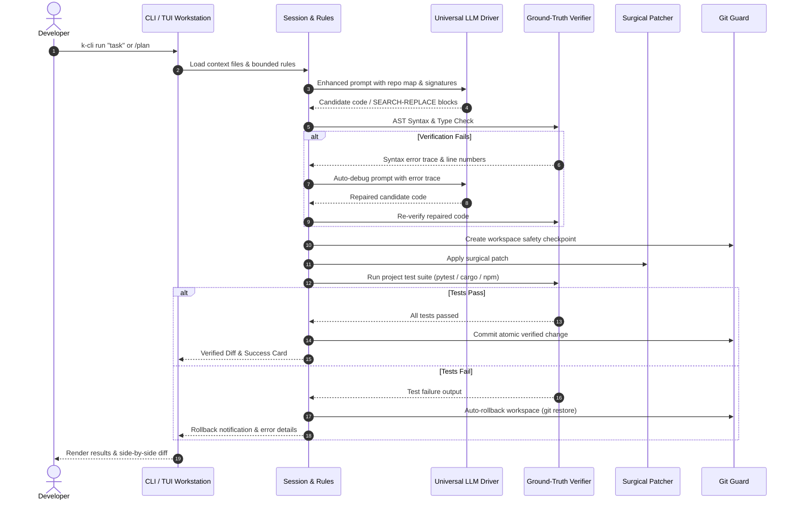

# K-CLI Architecture & Internal Design

K-CLI is a verification-first, multi-model agentic coding workstation designed for local and cloud workflows on standard developer machines.

---

## 1. High-Level Modular Architecture

K-CLI is structured into four distinct layers with clean boundaries:

```
+-----------------------------------------------------------------------------------+
|                        4. User Interface & Session Layer                          |
|   cli.py (Typer CLI Hub)  <--->  tui_app.py (Textual Cyber-Workstation)           |
|   tui.py (Interactive REPL) <---> tui_animations.py (Neon HUD / Speedometers)    |
+-----------------------------------------+-----------------------------------------+
                                          |
+-----------------------------------------+-----------------------------------------+
|                              1. Core Engine Layer                                 |
|   orchestrator.py (Pipeline/Memory)  <--->  llm_driver.py (Multi-Provider LLM)     |
|   verifier.py (AST / Compilers / Test Runners)                                    |
|   subagents.py (DAG Decomposition, Swarm Dispatcher, Role Workers)                 |
|   mcp_client.py (Universal Model Context Protocol Hub - stdio/SSE/HTTP)           |
|   incident_triage.py (Autonomous Crash Log Diagnosis & Regression Healer)          |
+--------------------+------------------------------------+-------------------------+
                     |                                    |
+--------------------+-------------------+    +-----------+-------------------------+
|     2. Knowledge & Context Layer       |    |       3. Modification & Safety Net  |
|  doc_retriever.py (SQLite FTS5 / BM25) |    |  patcher.py (SEARCH/REPLACE Blocks) |
|  repo_map.py (AST Symbol Graph)        |    |  git_guard.py (Snapshots & Rollback)|
|  dedup_engine.py (Anti-Overlap Scanner)|    |  conflict_resolver.py (3-Way Merge) |
|  diagram_generator.py (Mermaid Engine) |    |  github_client.py (PR Lifecycle)    |
|  rules.py (Bounded Untrusted Context)  |    |  smart_git.py (Conventional Commits)|
|  workflow.py (Protected Read-Only Plan)|    |  security_healer.py (Vuln Healer)   |
+----------------------------------------+    +-------------------------------------+
```

---

## 2. Core Layers & Responsibilities

### Layer 1: User Interface & Session (`cli.py`, `tui_app.py`, `tui.py`, `tui_animations.py`, `session.py`)
- **Textual Cyber-Workstation (`tui_app.py`)**: Full-screen terminal workstation built with Textual. Provides reactive status badges, collapsible reasoning accordions, **Interactive 3-Way Conflict Studio**, **GitHub PR Hub**, **MCP Server Inspector**, and **Swarm Radar**.
- **Visual & Animation Engine (`tui_animations.py`)**: Real-time token speedometer (`tok/s`), cost ticker ($ USD estimation), cyberpunk neon ASCII splash banners, and animated status glow badges.
- **Typer CLI (`cli.py`)**: Unix-friendly single-shot command line interface supporting `run`, `plan`, `conflict`, `pr`, `mcp`, `dedup`, `commit`, `security`, `triage`, `verify`, `audit`, `diff`, `doctor`, `map`, `doc`, and `ui`. Full `--json` machine-readable output for CI/CD automation.

### Layer 2: Core Engine & Verification (`orchestrator.py`, `llm_driver.py`, `verifier.py`, `subagents.py`, `mcp_client.py`, `incident_triage.py`)
- **Universal LLM Driver (`llm_driver.py`)**: Multi-provider client abstraction supporting Ollama, native llama.cpp / GGUF, Google Gemini, Anthropic Claude, DeepSeek, OpenRouter, OpenAI, and arbitrary OpenAI-compatible REST gateways (`--base-url`).
- **Universal MCP Hub (`mcp_client.py`)**: Production client for the Model Context Protocol (MCP) supporting `stdio` subprocesses and `SSE/HTTP` transports, dynamic tool calling, resource inspection, and prompt discovery.
- **Incident Triage & Auto-Heal (`incident_triage.py`)**: Autonomous diagnosis for Python, Node.js, Rust, Go, C++, Docker crash logs, and GitHub Actions CI failures, synthesizing verified regression test cases and patches.
- **Ground-Truth Verifier (`verifier.py`)**: Multi-language static and dynamic verification: Python AST parsing, compilation, Bash syntax checking (`bash -n`), C++ compilation (`g++ -fsyntax-only`), and multi-framework test runners (`pytest`, `npm test`, `cargo test`, `go test`).
- **Subagent Swarm Dispatcher (`subagents.py`)**: DAG task decomposer and parallel worker dispatcher with role specializations (`EXPLORER`, `RESEARCHER`, `REFACTORER`, `TESTER`, `CODER`, `CONFLICT_RESOLVER`, `PR_REVIEWER`, `MCP_OPERATOR`).

### Layer 3: Knowledge, Intelligence & Deduplication (`doc_retriever.py`, `repo_map.py`, `dedup_engine.py`, `diagram_generator.py`, `rules.py`, `workflow.py`)
- **Repository Deduplication Engine (`dedup_engine.py`)**: Scans Git commit history and AST symbol tables using hybrid BM25 + Jaccard similarity to prevent duplicate tasks or redundant code creation.
- **Mermaid Diagram Generator (`diagram_generator.py`)**: Auto-generates architecture flowcharts, sequence diagrams, and class diagrams directly from AST dependencies.
- **DevDocs SQLite Indexer (`doc_retriever.py`)**: High-speed offline SQLite FTS5 database with BM25 ranking for standard library and framework API signatures (< 5ms search latency).
- **AST Codebase Map (`repo_map.py`)**: PageRank-weighted codebase summaries from AST symbols.

### Layer 4: Modification, GitHub Lifecycle & Safety Net (`patcher.py`, `git_guard.py`, `conflict_resolver.py`, `github_client.py`, `smart_git.py`, `security_healer.py`)
- **3-Way AI Conflict Resolver (`conflict_resolver.py`)**: Resolves 2-way and 3-way/diff3 Git merge conflicts using AST scope context and compiler verification gates.
- **GitHub PR Lifecycle Manager (`github_client.py`)**: Manages pull requests, fetches diffs/check runs, performs AI code reviews, self-healing automated fixes, and verified PR merges.
- **Smart Git Engine (`smart_git.py`)**: Analyzes AST changes in `git diff` to generate Conventional Commits and rich PR descriptions.
- **Autonomous Security Healer (`security_healer.py`)**: Detects and surgically remediates hardcoded secrets, SQL injections, unsafe `eval()`, ReDoS, and shell injections.
- **Surgical Patcher (`patcher.py`)**: Parses standard `<<<<<<< SEARCH ... ======= ... >>>>>>>` blocks with whitespace-tolerant fuzzy matching and pre-application AST validation.
- **Git Guard (`git_guard.py`)**: Automatic repository checkpoint snapshots before modifications and instant rollback (`git restore`) on verification failure.

---

## 3. The Verification-First Execution Loop



---

## 4. Security Model & Boundaries

1. **Credential Hygiene**: Verification subprocesses strip secret environment variables (`API_KEY`, `TOKEN`, `PASSWORD`, `SECRET`, `CREDENTIALS`) before execution.
2. **Process Boundaries**: Subprocess execution is wrapped with strict CPU/memory limits (`psutil`) and execution timeouts with process group termination (`killpg`).
3. **Untrusted Context Isolation**: Project rules (`.kcli/rules.md`) are explicitly labeled as `[UNTRUSTED REPOSITORY CONTEXT]` in model prompts and are never executed as system policies.
4. **Git Safety**: Every modification is guarded by a Git snapshot; failed runs cleanly restore the previous tree state.
